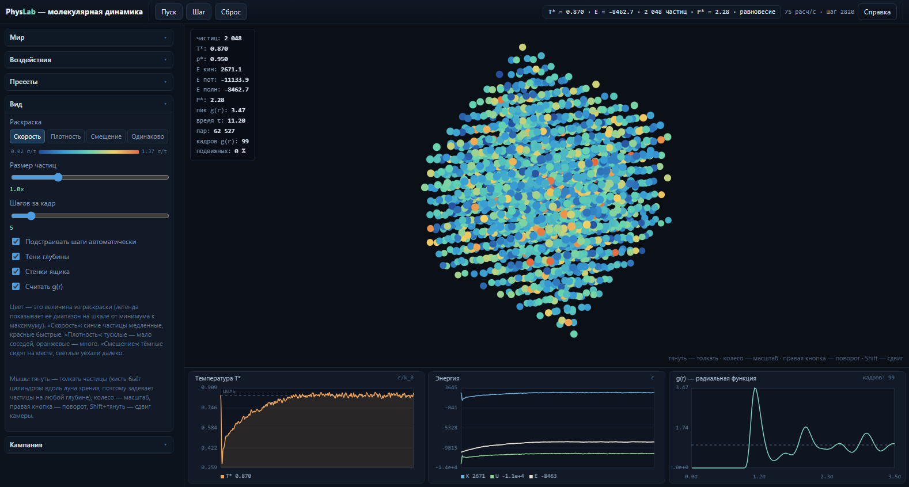
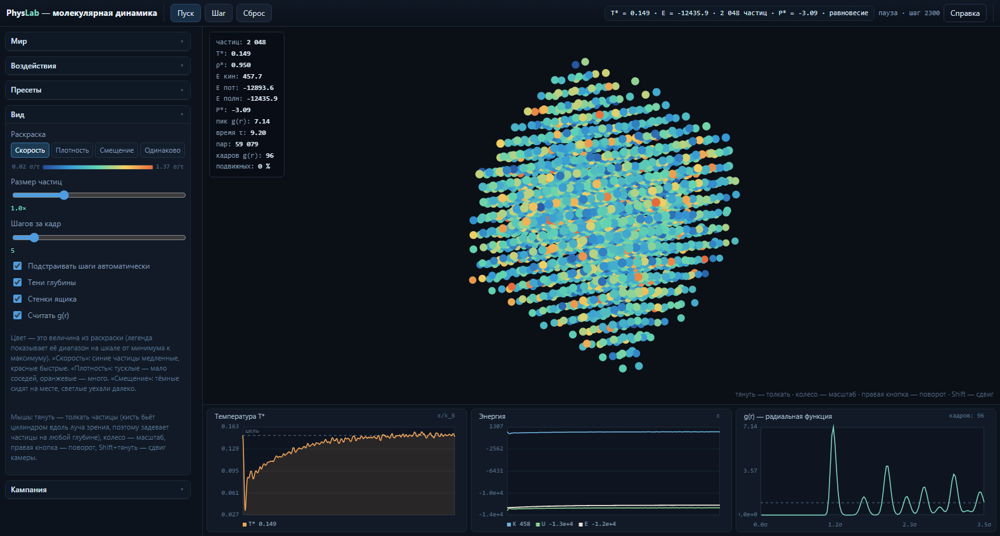
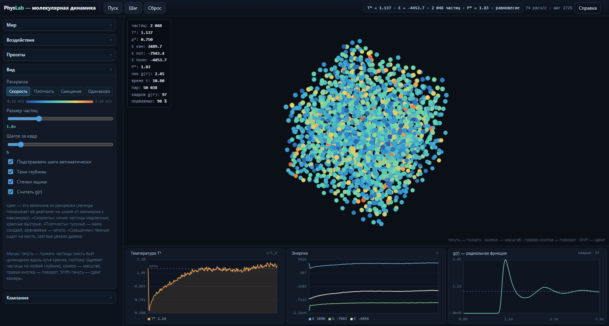
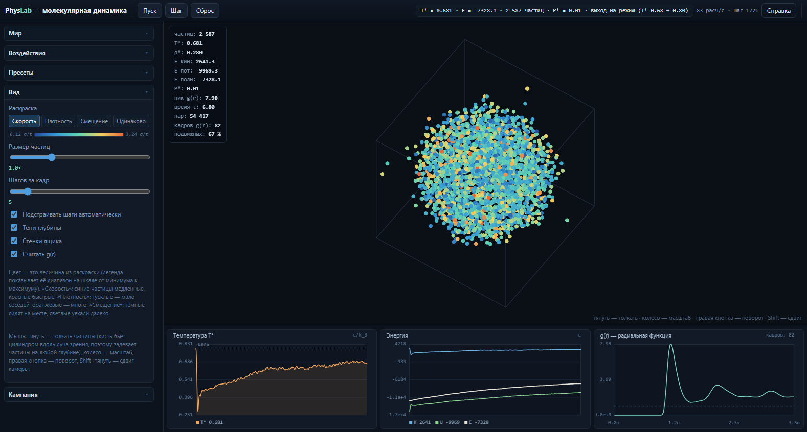
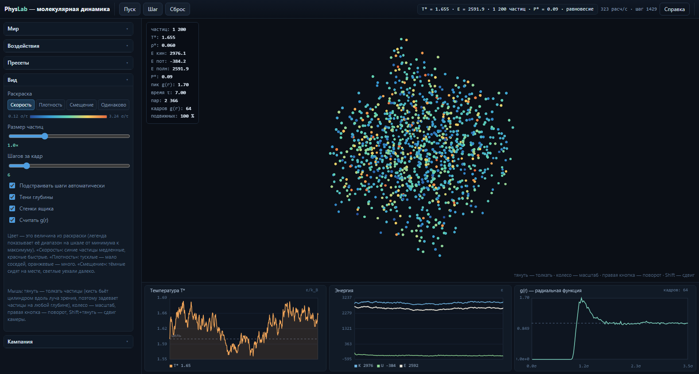

# Phys Lab

[](LICENSE)

> ## ⚠️ Внимание: проект написан ИИ-агентом
>
> **Весь этот код, документация и тесты созданы и поддерживаются языковой моделью
> (ИИ-агентом), а не человеком-инженером.** Это не «альфа» и не «демо» — рабочий
> проект с зелёными тестами и проверками в настоящем браузере, но в нём **возможны
> ошибки, недоработки, локально странные решения и устаревшие комментарии**.
> Дефекты находим и устраняем по мере обнаружения (см. раздел «Найденные и
> исправленные дефекты»), но полностью гарантировать их отсутствие нельзя.
>
> **Практические следствия — читать до того, как что-то трогать:**
> 1. **Не доверяй коду вслепую.** Перед правкой сверяйся с `docs/NEXT-SESSION.md`
>    (контракты, инварианты, ловушки) и с тестами; ИИ-код часто выглядит
>    убедительнее, чем работает.
> 2. **Ничего не «чиним» молча.** Нашёл дефект — добавь регрессионный тест и отметь
>    его в README, а не правь «по ходу дела»: иначе следующая ИИ-сессия про него
>    не узнает.
> 3. **Ломать обратно легко.** ИИ-сессия, не прочитавшая `docs/NEXT-SESSION.md`,
>    с высокой вероятностью вернёт уже исправленный дефект.
> 4. **Юнит-тесты не видят браузер.** Три дефекта из истории проекта юнит-тесты
>    не поймали бы в принципе: немонтированный канвас, наложение панелей вместо
>    скролла и потеря насыщенности цвета. Меняешь рендер, вёрстку или палитру —
>    прогоняй `npm.cmd run smoke` и `npm.cmd run showcase`.
> 5. **Численные ошибки не видны глазом.** Перепутанный знак силы выглядит как
>    «нормальная симуляция» ровно до момента, когда система схлопывается.
>    Меняешь силы или интегратор — прогоняй тесты на сохранение энергии.
> 6. **Потерянные пары не видны вообще.** Дефекты 15–17 (см. ниже) давали не
>    падение, а тихо неправильную физику: часть сил просто не считалась.
>    Проверка — сравнение числа пар с честным перебором, и она есть и в
>    юнит-тестах, и в `smoke`.

Интерактивная песочница молекулярной динамики: ящик с частицами, между которыми
действует **потенциал Леннарда-Джонса**. Фазовые переходы здесь не запрограммированы —
они **возникают** из уравнений движения: частицы сами собираются в кристалл,
плавятся, испаряются, образуют жидкость и капли.



> **Что на кадре.** ГЦК-кристалл (2048 частиц, ρ* = 0.95) нагрет до T* = 0.87.
> Дальний порядок уже потерян — частицы ушли с узлов, — но ближний сохранён:
> график g(r) справа показывает три размытых пика на расстояниях, кратных σ.
> Слева внизу — температура (жёлтая линия идёт к заданной, пунктир), в центре —
> энергии (K, U, E). Цвет частицы — её скорость: синие медленные, красные быстрые.
>
> **Кадр воспроизводится командой** `npm.cmd run showcase` — она собирает все
> витринные кадры заново и падает с ненулевым кодом, если сцена оказалась пустой.
> Поэтому картинки в README не нужно обновлять вручную.

### Состояния системы

| Кристалл (T* = 0.15) | Жидкость (T* = 1.10) |
|---|---|
|  |  |

| Капля (поверхностное натяжение) | Газ (T* = 1.62) |
|---|---|
|  |  |

> **Кристалл.** Частицы колеблются около узлов ГЦК-решётки. Первый пик g(r)
> равен 7.2 — это дальний порядок.
>
> **Жидкость.** Частицы двигаются, но держатся вместе; первый пик падает до 2.4,
> пики размываются: ближний порядок есть, дальнего нет.
>
> **Капля.** Свободная капля в пустоте: поверхностные атомы «недосчитались»
> соседей, и система стягивается в шар — минимум площади поверхности при
> заданном объёме.
>
> **Важно про температуру капли.** Первый пик g(r) ≈ 8 при T* = 0.69 означает,
> что это **кристаллический кластер, а не жидкость**. Температура плавления
> объёмного Леннард-Джонса при ρ* = 0.95 равна T* ≈ 0.7, а капля при
> плотности 0.28 имеет меньшую координацию и плавится раньше — поэтому при
> T* ≈ 0.7 её ядро ещё упорядочено. Не читайте этот кадр как «так выглядит
> жидкость»: чтобы увидеть жидкую каплю, поднимите T* до 0.9–1.1, тогда
> первый пик упадёт до 2.5–3.5.
>
> **Газ.** Разрежённая система: g(r) почти единица везде, кроме горба на
> расстоянии притяжения.

---

## Быстрый старт

Двойной щелчок по **`start.bat`** — он проверит Node.js, при необходимости поставит
зависимости, соберёт проект, поднимет локальный сервер и откроет браузер.
Переменные окружения: `PORT` (по умолчанию 4174), `NO_BROWSER=1` — не открывать
браузер, `ALWAYS_BUILD=1` — пересобрать даже при готовой папке `dist`.

Или вручную:

```bash
npm.cmd install      # в PowerShell: npm.ps1 может блокироваться политикой запуска
npm.cmd run dev      # откройте адрес, который выведет Vite
```

| Команда | Что делает |
|---|---|
| `npm.cmd run dev` | Запуск в режиме разработки с горячей перезагрузкой |
| `npm.cmd run build` | Проверка типов + сборка в `dist/` |
| `npm.cmd run preview` | Локальный просмотр собранной версии |
| `npm.cmd test` | Юнит-тесты ядра (107 тестов) |
| `npm.cmd run bench` | Замеры производительности ядра |
| `npm.cmd run smoke` | Сквозная проверка в настоящем Chrome (47 проверок) |
| `npm.cmd run showcase` | Пересобрать витринные кадры `docs/images/*.png` |
| `npm.cmd run typecheck` | Только проверка типов |

Собранная версия работает и с `file://`: база сборки относительная.

---

## Что уже готово

* **Потенциал Леннарда-Джонса** с обрезанием по схеме shifted-force: сила
  непрерывна на радиусе обрезания, энергия согласована с силой.
* **Интегрирование Верле** (скоростная форма) — симплектическое, энергия
  сохраняется. Проверено тестом на дрейф энергии и тестом на обратимость.
* **Списки соседей Верле с «кожей»** — главный ускоритель: список
  перестраивается раз в 10–25 шагов, а не каждый шаг.
* **Сетка ячеек** для поиска соседей: O(N) вместо O(N²).
* **Четыре режима термостата**: Берендсен, Ланжевен, Нозе-Хувер и «нет»
  (микроканонический ансамбль).
* **Три типа границ**: периодические, отражающие стенки, открытые
  (для испарения).
* **Радиальная функция g(r)** — строится по сетке, линейна по числу частиц.
* **Интерактив**: слайдеры T*, ρ*, числа частиц; кнопки «нагреть», «сжать»,
  «заморозить»; протяжка мышью создаёт локальное возмущение.
* **Графики**: температура, энергии (K, U, E), g(r).
* **Девять пресетов**: кристалл, плавление, жидкость, газ, конденсация, капля,
  испарение, диффузия, микроканонический.
* **Кампания из 10 уровней** с теорией, подсказками и автопроверкой: от
  «посмотри на кристалл» до «собери кристалл из газа».
* **Мышь и клавиатура**: толкать частицы, масштаб колесом, поворот правой
  кнопкой, пауза пробелом, сброс по R.
* **Кисть — цилиндр вдоль луча зрения**: клик достаёт до частиц на любой
  глубине (100 % частиц достижимо, проверяется в `smoke`), а не только до
  среднего слоя. Размер кольца на экране совпадает с физическим радиусом.
* **Защита от численного разлёта**: скорость ограничена тем, что разрешает шаг
  интегрирования, а состояние с `NaN` распознаётся и восстанавливается.
  Поэтому «нагреть и сжать до предела» больше не приводит к необратимому
  состоянию, из которого не выводят ни охлаждение, ни расширение.

---

## Архитектура

### Стек и почему именно он

| Решение | Обоснование |
|---|---|
| **TypeScript** (strict) | Модель состояния — плоские типизированные массивы с инвариантами (индексы частиц, ячейки, полуторный список соседей). Типы ловят целый класс ошибок ещё до запуска. |
| **Vite** | Мгновенный старт, встроенный TS, быстрая сборка. |
| **PixiJS 8 (WebGL)** | Частицы — это `Particle` в одном `ParticleContainer`: 20 000 частиц рисуются одним батчем. Canvas2D столько не тянет. |
| **Canvas2D для графиков** | Графики обновляются редко, линий мало; Canvas2D здесь проще и дешевле, чем WebGL. |
| **Без React, DOM вручную** | Интерфейс — десяток панелей с редкими обновлениями, а весь горячий рендер всё равно в Pixi. Свой `h()` (~180 строк) убрал согласование состояния между фреймворком и сценой. |
| **Vitest** | Ядро не знает про DOM, поэтому тесты идут в чистом Node за секунды. |

### Структура

```
src/
  core/        ЯДРО. Ничего не знает про DOM, Pixi и localStorage.
    types.ts       модель состояния, плоские массивы частиц (SoA)
    potential.ts   потенциал Леннарда-Джонса, сдвиг, производные
    forces.ts      расчёт сил: обход сетки и обход списка соседей
    neighbours.ts  списки Верле с «кожей» (формат CSR)
    grid.ts        сетка ячеек (counting sort)
    integrator.ts  Верле, границы, четыре термостата, внешние воздействия
    measure.ts     T, E, P, g(r) по сетке, смещение и подвижность
    initializers.ts ГЦК, кубическая, случайный газ, капля; максвелловские скорости
    velocity.ts    дрейф центра масс, кинетическая энергия
    world.ts       сборка: шаг, управление, измерения, проекция
    presets.ts     девять пресетов
    rng.ts         детерминированный xoshiro128** + быстрый Гаусс
  render/      PixiJS: сцена, камера, палитра, графики.
  input/       Мышь и клавиатура.
  levels/      Описание уровней и вычисление условий проверки.
  ui/          DOM-панели, markdown, кампания, справка.
  app/         Склейка: состояние, цикл симуляции.
  test/        Юнит-тесты ядра.
```

### Как устроен шаг

```
1. v += F·dt/2                     половинный «толчок» (kick)
1a. маска заморозки                 v = 0 у замороженных (иначе дрейф их сдвинет)
2. термостат                        трогает только скорости
2a. маска заморозки снова           термостат масштабирует ВСЕ скорости
2b. ограничитель скорости           путь за шаг не больше 5 % σ
3. x += v·dt, заворачивание в ящик  «дрейф» (drift)
4. перестроить список соседей       только если исчерпана «кожа»
5. F по списку соседей              главная работа шага
6. v += F·dt/2                      вторая половина толчка
7. маска заморозки и снова          вторая половина тоже добавила скорость
8. измерения                        T, E, P, смещение; проверка на NaN
```

Термостат стоит **между** половинами толчка намеренно: так он не разрушает
симплектическую структуру схемы, и энергия без термостата сохраняется.

Маска заморозки накладывается **на каждой стадии, меняющей скорость** (1a, 2a,
7). Это не избыточность: без шага 1a замороженные частицы «проезжали» 8σ за 200
шагов, без шага 2a термостат возвращал им движение (см. дефект 27).

---

## Производительность

Проект оптимизировался по замерам, а не по интуиции. Замеры — на 20 000 частиц,
ρ* = 0.7, T* = 1.0 (Node, один поток):

| Что | До | После | Во сколько раз |
|---|---|---|---|
| **Кадр статистики g(r)** | 1904 мс | 42 мс | **×45** |
| Полный шаг физики | 52 мс | 14 мс | **×3.7** |
| Построение списка соседей | 45 мс | 25 мс | ×1.8 |
| Термостат Ланжевена | 3.7 мс | 0.9 мс | ×4.1 |
| Расчёт сил по списку | — | 6.6 мс | — |

Что именно сделано:

1. **Списки Верле вместо обхода ячеек.** Сетка даёт O(N), но с большой
   константой: для ρ* = 0.7 и rc = 2.5 у частицы ~46 настоящих соседей, а
   просматривать приходится 27 ячеек по ~17 частиц — 464 кандидата. Список
   с «кожей» 0.4σ перестраивается раз в ~15 шагов, а между перестройками
   шаг трогает только настоящих соседей.
2. **Гистограмма g(r) по сетке.** Была честная O(N²) — 1.9 секунды на кадр.
   Приложение упиралось именно в неё, а не в физику: один кадр статистики
   стоил дороже 380 шагов симуляции. Теперь у g(r своя сетка с ячейкой,
   равной максимальному радиусу (3.5σ), поэтому достаточно 27 соседних ячеек.
3. **Минимальный образ без деления.** `dx -= box·Math.round(dx/box)` — это три
   деления на пару; заменено на одну поправку `if (dx > half) dx -= box`.
4. **Проекция без тригонометрии в цикле.** `Math.cos(yaw)` вызывался на каждую
   частицу — 80 000 вызовов на кадр при 20 000 частиц.
5. **Быстрый Гаусс (Бокс — Мюллер).** Полярный метод Марсальи тратит
   в среднем 1.6 вызова генератора на число из-за отбраковки; в термостате
   Ланжевена нормальных чисел нужны миллионы.
6. **Построение списка за один обход.** Пары собираются в два плоских буфера
   за проход по ячейкам, а раскладка в CSR идёт по парам (их в 7 раз меньше,
   чем кандидатов).
7. **Автоподстройка шагов на кадр.** Приложение измеряет стоимость шага и само
   снижает их число на больших системах, чтобы картинка осталась плавной.

### Что важно знать про эти числа

* Это **замеры в Node на одном потоке**, без отрисовки. В браузере добавляется
  работа WebGL, но она идёт параллельно с расчётом.
* Рост стоимости **линейный**: на 2 048 частиц шаг 1.5 мс, на 20 000 — 14 мс,
  то есть ×9.3 при ×9.6 частиц. Квадратичный рост дал бы ×100.
* Достижимый предел в браузере на одном потоке — примерно 50 000 частиц при
  dt = 0.004. Дальше нужен Web Worker или WebGPU (см. `ROADMAP.md`).

---

## Физика: что именно считается

Все величины — в **приведённых единицах Леннарда-Джонса**: ε = σ = m = k_B = 1.
Для аргона σ ≈ 0.34 нм, ε/k_B ≈ 120 К, то есть T* = 1.0 соответствует ≈ 120 К.

| Величина | Формула | Комментарий |
|---|---|---|
| Потенциал | `U(r) = 4(r⁻¹² − r⁻⁶)` | Минимум −1 при r = 1.122σ, ноль при r = σ |
| Сила | `F(r)/r = 24(2r⁻¹⁴ − r⁻⁸)` | Считается как F/r, чтобы не делить в цикле |
| Обрезание | shifted-force | `F_sf(r) = F(r) − s·r`, s = F(rc)/rc |
| Энергия | `U_sf(r) = U(r) − U(rc) + ½s(r² − rc²)` | Последнее слагаемое обязательно: без него энергия не сохраняется |
| Температура | `T = 2K / (3N − 3)` | Три степени свободы забраны центром масс |
| Давление | `P = (NT + W/3) / V` | Вириальная теорема, W = Σ F·r |
| g(r) | `⟨пар в слое⟩ = N(N−1)/2 · 4πr²dr/V · g(r)` | Нормировка на идеальный газ |

### Ловушки, на которых проект уже спотыкался

**Знак силы.** Если `d = r_j − r_i`, то сила НА частицу i направлена **против** d:
`F_i = −(F/r)·d`. Ошибка в знаке не ломает ничего заметно на глаз: система просто
притягивается там, где должна отталкиваться, и за 50 шагов энергия улетает в 10³⁰.
Тесты «на модуль силы» её пропускают — поэтому направление проверяется отдельно:
совпадением с производной энергии и признаком «частицы не слипаются».

**Энергия, не согласованная с силой.** При обрезании shifted-force потенциал —
уже не просто сдвинутый `U(r)`. Если забыть слагаемое `½s(r² − rc²)`, сила
остаётся правильной, а энергия перестаёт быть её интегралом, и симплектический
интегратор начинает систематически греть или охлаждать систему. Слагаемое мало
(|s| ≈ 0.01), поэтому ошибку легко не заметить.

**Подвижность по пути вместо смещения.** У кристалла частица колеблется вокруг
узла, накапливая за минуту несколько σ **пути**, но оставаясь в пределах 0.1σ
**смещения**. Признак «система расплавилась» обязан считаться по смещению:
по пути кристалл выглядел бы жидкостью — так и провалился уровень «Кристалл».

**Решётка, не согласованная с ящиком.** Если построить ГЦК-решётку на
`ceil(cbrt(N/4))` ячейках, а длину ящика взять из `(N/ρ)^(1/3)`, эти числа
окажутся не связаны, и настоящая плотность кристалла будет `4/a³` — совсем не
та, что просили. Решение: сначала число ячеек `n`, затем реальное число частиц
`N = 4n³`, и только потом `L = (N/ρ)^(1/3)`. Плотность точная, вакансий нет.

**Клетка сетки меньше радиуса поиска.** Если ячейка меньше `rc + skin`, сосед
может оказаться не в соседней ячейке, а через одну, и часть пар теряется.
Множитель 1.35 покрывает кожу 0.4σ с запасом.

---

## Найденные и исправленные дефекты

Все дефекты ниже реально случались в этом проекте. Раздел существует, чтобы
следующая сессия не «исправила» их обратно и не наступила на те же грабли.

| № | Дефект | Как проявлялся | Чем ловится |
|---|---|---|---|
| 1 | **Перепутан знак силы** | Система притягивалась вместо отталкивания; энергия улетала в 10³⁰ за 50 шагов | Тест «сила = производная энергии», smoke-проверка «частицы не слипаются» |
| 2 | **Энергия не согласована с силой** | Медленный нагрев без термостата: +25ε за 10 шагов | Тест «энергия не дрейфует», тест на обратимость |
| 3 | **Решётка против ящика** | Настоящая плотность 1.06 вместо 0.85 → мгновенный «взрыв» | Тест «плотность совпадает с N/V» |
| 4 | **Вакансии в ГЦК** | Оставшиеся узлы пустыми, соседи «переезжают» | Идеальная решётка: N = 4n³, тест на минимальное расстояние |
| 5 | **Канвас не смонтирован** | Приложение считает кадры, на экране пусто | Smoke: «канвас создан и имеет ненулевой размер» |
| 6 | **Панели сжимаются вместо скролла** | Вкладки налезают друг на друга, подписи обрезаны | Smoke: «панели боковой колонки не перекрываются» |
| 7 | **Подписи кнопок обрезаны** | «Нозе-Хувер» → «Нозе-Хуве» | Smoke: «подписи переключателей не обрезаны» |
| 8 | **g(r) как O(N²)** | Кадр статистики 1.9 с на 20 000 частиц | Smoke: «кадр статистики дешевле 100 мс» |
| 9 | **Белёсые частицы** | Туман из-за наложения полупрозрачных краёв вдоль луча зрения | Smoke: «частицы окрашены разнообразно и непрозрачны» |
| 10 | **Кисть в мировых координатах** | Кольцо приклеено к левому краю сцены | Smoke: «правая кнопка поворачивает сцену» (рендерер) |
| 11 | **`colorValues` падал после resize** | `RangeError: offset is out of bounds` при смене числа частиц | Smoke: проверки пресетов и resize |
| 12 | **Подвижность по пути** | Уровень «Кристалл» не проходился: 100 % частиц «подвижны» | Smoke: «уровень 1 проходится» |
| 13 | **Захват указателя бросал исключение** | Правая кнопка не поворачивала сцену | Smoke: «правая кнопка поворачивает сцену» |
| 14 | **Полуторный список без упорядочивания** | Часть пар записывалась «наоборот» и терялась | Тест «каждая пара встречается ровно один раз» |

Вторая волна дефектов — из аудита «поиграй и расскажи, что не так». Все они
относятся к классу «приложение работало, но считало/показывало не то», поэтому
на каждый оставлен регрессионный тест.

| № | Дефект | Как проявлялся | Чем ловится |
|---|---|---|---|
| 15 | **Сетка ячеек меньше радиуса поиска** | В маленьком ящике (N ≤ ~900 при ρ* = 1.3) ячейка выходила меньше `rc + кожа`. Сосед попадал «через одну» ячейку, и часть пар терялась **молча**: силы в них не считались. Измерено: N = 256, ρ* = 1.3 — 451 пара из 9984 (4.5 %); N = 500 — 875 из 19500. Система просто медленно «остывала». | Тест «N пар совпадает с перебором» для опасных комбинаций; smoke «соседи не теряются ни в одной комбинации ползунков» |
| 16 | **Буфер пар списка Верле переполнялся** | Ёмкость бралась как `count * 64` «с запасом». При ρ* = 1.3 в радиусе 2.9σ соседей около **66** на частицу — больше 64. Запись за конец `Int32Array` в JS игнорируется молча, поэтому лишние пары исчезали: N = 2048 — 3565 из 79872 (4.5 %). Ёмкость теперь выводится из плотности, а при нехватке буфер удваивается и проход повторяется. | Тест «computeForcesDirect не зависит от числа частиц»; smoke-проверка числа пар на ρ* = 1.3 |
| 17 | **Кисть доставала только до среднего слоя** | Обратная проекция восстанавливала точку на «плоскости экрана» (z = 0) и ограничивала воздействие сферой вокруг неё. Клик в любую точку экрана задевал один и тот же слой: y ∈ [4.2, 9.7]σ при ящике 14σ, достижимо ~40 % частиц. Кисть теперь — **цилиндр вдоль луча зрения**, инвариантный к сдвигу вдоль него: достижимо 100 % частиц, разброс по y 13.9σ при ящике 14σ. Размер кольца на экране совпал с физическим радиусом. | Тест «ось взгляда согласована с проекцией», «кисть задевает частицы по всей глубине»; smoke «кисть достаёт до большинства частиц» |
| 18 | **g(r) теряла пары в мелком ящике** | Та же причина, что у дефекта 15, но в собственной сетке g(r): проверялось число ячеек (`n < 3`), а не фактический размер. При ячейке 2.4σ вместо 3.5σ кривая недосчитывала пары. Теперь проверка идёт по `grid.size`, и при нехватке включается честный перебор. | Тест «g(r) в маленьком ящике согласована с перебором»; smoke-проверка интеграла g(r) |
| 19 | **Автоподстройка шагов уезжала в 1** | Кадр статистики g(r) считался ВНУТРИ замера `physicsMs`, хотя стоит как несколько шагов. Автоподстройка делила суммарное время на число шагов и видела завышенную «стоимость шага» — на здоровой системе из 2048 частиц число шагов съезжало к 1 (измерено: 8 → 1 за пять секунд). Теперь g(r) считается после замера, а ползунок не переписывается вслепую. | Тест «шаг не деградирует при включённой статистике»; smoke-проверка автоподстройки |
| 20 | **Флажка автоподстройки не было в интерфейсе** | `state.autoSteps` существовал и работал, но включить/выключить его из UI было нельзя: ползунок «Шагов за кадр» выглядел рабочим и «сам» менялся. Добавлен флажок «Подстраивать шаги автоматически». | Smoke: «автоподстройка шагов включается и выключается из интерфейса» |
| 21 | **Цвет частиц ничем не объяснялся** | Легенда состояла из слов «мин»/«макс» и не говорила ни что кодирует цвет, ни в каких единицах. Теперь концы шкалы подписаны настоящими значениями из той же функции, что и рендер (`0.10 σ/τ … 4.55 σ/τ` для скорости), а в панели «Вид» написано, что означает каждый режим. | Smoke: «легенда раскраски показывает числовые границы шкалы» |
| 22 | **«0 расч/с» на паузе выглядело как поломка** | Счётчик частоты показывал ноль, хотя это верное поведение. Теперь на паузе выводится `пауза · шаг N`. | Smoke-проверка паузы |
| 23 | **Нажатие «Шаг» не давало отклика** | Один шаг визуально почти ничего не меняет, и нажатие выглядело «пустым». Добавлена короткая подсветка кнопки. | Smoke: «кнопка «Шаг» делает ровно один шаг и подсвечивается» |
| 24 | **Сводка на сцене читалась как подпись** | Главный «прибор» (T*, E, P*, g(r), τ) был обычным текстом с тенью и терялся на фоне частиц. Теперь это карточка с фоном и рамкой, добавлены «кадров g(r)» и «подвижных». | Smoke: «HUD показывает кадры g(r) и долю подвижных» |
| 25 | **Не было признака «система вышла на режим»** | Игрок не мог понять, можно ли доверять цифрам. В сводку добавлен индикатор: «выход на режим (T* …)», «набор статистики (N/20)» или «равновесие». | Smoke: «в сводке есть признак равновесия или набор статистики» |
| 26 | **Дублирующийся множитель размера ячейки** | `CELL_SIZE_FACTOR` существовал в двух местах с разными значениями (1.05 и 1.35). Работал тот, что в `grid.ts`, но расхождение — приглашение вернуть дефект 15. Константа осталась одна. | Тест-инвариант «ячейка ≥ rc + кожа» |

Третья волна — из отзыва «поиграл, заморозил — а они двигаются, нагрел со сжатием — взлетело, частицы не меняют цвет». Это оказались три независимых дефекта, два из которых делали систему нерабочей без возможности восстановления.

| № | Дефект | Как проявлялся | Чем ловится |
|---|---|---|---|
| 27 | **«Остановить» не останавливала** | `freezeAll` только обнуляла скорости ОДИН раз и не ставила маску заморозки. Уже на следующем шаге `kick` придавал частицам скорость по силам, а термостат возвращал их к целевой T* (при нулевых скоростях измеренная температура равна нулю — для термостата это максимальное отклонение от цели). Измерено: за 200 шагов кристалл «проезжал» 8.06σ при заявленной остановке. Маска теперь накладывается после каждого этапа, меняющего скорость. | Тест «freezeAll держит частицы на месте», «заморозка переживает все термостаты»; smoke ««Остановить» действительно обнуляет движение» |
| 28 | **Протяжка мышью разгоняла систему до абсурда** | Импульс прибавлялся на КАЖДОМ событии движения и был пропорционален всему пути курсора. При масштабе ~18 px/σ протяжка 200 px давала 37 σ/τ на частицу (тепловая скорость ≈ 1.7). Кристалл разгонялся до T* = 3.6, а «протянуть и подождать» уводило полную энергию в 10¹⁷. Вектор импульса ограничен `MAX_POKE_SPEED`, а сами импульсы за кадр накапливаются, а не перекрываются. | Тест «длинная протяжка не разгоняет систему», «импульсы накапливаются»; smoke «огромная протяжка не разгоняет систему» |
| 29 | **Численный разлёт был необратим** | Главная причина «ни охлаждение, ни расширение не помогает». Выше T* ≈ 50 дискретизация Верле теряет устойчивость: частица за шаг перескакивает сердечник потенциала, сила растёт экспоненциально, а термостат убирает лишь ~1 % энергии за шаг. Измерено: от T* = 1.45·10³⁹ система уходила к **5.7·10⁸⁴** (энергия 10⁴⁷) — вернуть её было нельзя ничем. Добавлен предел скорости `maxStableSpeed(dt)` (путь за шаг ≤ 5 % σ) и восстановление при NaN. После исправления тот же сценарий возвращается к T* ≈ 12. | Тест «ограничитель не даёт выбросу разрастись», «в штатных режимах ограничитель не срабатывает»; smoke «нагрев и сжатие не уводят в разлёт» |
| 30 | **Одиночный выброс убивал раскраску** | Вторая половина «частицы не меняют цвет». Шкала строилась по абсолютному максимуму: одной частицы со скоростью 10²³ хватало, чтобы у ВСЕХ остальных `t = (v−min)/(max−min) ≈ 1e−24` — измерено **100 % частиц** получали одинаковый «медленный» цвет, и картинка переставала реагировать. Верхняя граница шкалы теперь квантиль 0.995 по логарифмической сетке: выброс не управляет палитрой, а широкое распределение газа сохраняется. | Тест «одна аномальная частица не делает всех одного цвета», «широкое распределение не зажимается»; smoke «выброс не делает все частицы одного цвета» |


---

## Кампания

Десять уровней с теорией, подсказками и автопроверкой. Уровень — это данные
(`src/levels/levels.ts`), а не код; условия проверки декларативны и вычисляются
отдельным модулем.

| № | Уровень | Что требуется |
|---|---|---|
| 1 | Кристалл | Убедиться, что доля подвижных частиц < 4 %, а пик g(r) > 3 |
| 2 | Плавление | Нагреть до T* ≥ 0.6 так, чтобы решётка «поплыла» |
| 3 | Испарение | Открыть границы и нагреть до T* ≥ 1.3: 40+ частиц улетают |
| 4 | Диффузия | Понизить плотность и нагреть: MSD растёт, подвижно > 60 % |
| 5 | Капля | Собрать свободную каплю: 80 % частиц держатся вместе |
| 6 | Конденсация | Остудить газ: энергия падает на 25 %, появляется пик g(r) |
| 7 | Уравнение состояния | Сжать до ρ* ≥ 1.0 и увидеть рост давления |
| 8 | Без термостата | Выключить термостат: дрейф энергии < 0.3 % |
| 9 | Стенки против границ | Включить отражающие стенки и сравнить |
| 10 | Сборка | Из газа получить кристалл: ρ* ≥ 0.85, пик g(r) ≥ 4.5 |

Проверки считаются по **окну усреднения**, а не по одному кадру: мгновенная
доля подвижных частиц колеблется на проценты, и решение по одному замеру было
бы случайным. Перед началом измерения система проходит «выход на режим» —
столько шагов, сколько указано в уровне.

---

## Управление

| Действие | Результат |
|---|---|
| Тянуть левой кнопкой | Толкать частицы — локальное возмущение |
| Колесо мыши | Масштаб |
| Правая кнопка + тянуть | Поворот сцены |
| Shift + тянуть | Сдвиг камеры |
| Пробел | Пауза / продолжить |
| R | Пересобрать систему |
| H | Справка |

---

## Что дальше

В `ROADMAP.md` расписаны уровни 2 и 3: молекулы с химическими реакциями
(пружинные связи, правила реакций, автокатализ) и макрофизика (твёрдые тела,
SPH-жидкости, сыпучие среды). Уровень 1 — то, что реализовано здесь — выбран
первым, потому что молекулы и тела строятся на тех же численных методах.

Ближайшие технические шаги — в `docs/NEXT-SESSION.md`: вынос физики в Web Worker
(чтобы интерфейс не подвисал на больших системах) и переход на WebGPU для
преодоления потолка в ~50 000 частиц.

---

## Что дальше

Уровень 1 доведён до состояния, когда добавление новых возможностей перестаёт
улучшать проект по существу: физика верна (силы, энергия, ансамбли, устойчивость
дискретизации), производительность линейна и измерена, интерфейс объясняет то,
что показывает. Дальше начинаются «фичи для фич» — а это уже другой проект.

Ближайшие осмысленные шаги, по убыванию пользы:

1. **Web Worker для физики.** Ядро не знает про DOM — его можно вынести почти
   как есть. Уберёт подтормаживание интерфейса на больших системах.
2. **Сохранение и загрузка состояния** (JSON + seed): сейчас воспроизводимость
   есть, но только внутри сессии.
3. **Уровень 2: молекулы.** Пружинные связи и правила реакций. Ключи `type` и
   `charge` у частиц уже заложены в `core/types.ts`.
4. **Частные g(r) по типам пар** (A–A, A–B, B–B) — понадобится для ионных систем.
5. **WebGPU-рендер** для 100 000+ частиц.

Признак законченной работы — не «добавить нечего», а «дальше — отдельный
проект». По этому критерию Уровень 1 закрыт.

---

## Лицензия

**MIT** — см. [`LICENSE`](LICENSE). Copyright (c) 2026 pL1uXa-AI.

Коротко: код можно свободно использовать, копировать, изменять, публиковать и
продавать; достаточно сохранить текст лицензии и указание авторства. Проект
поставляется «как есть», без гарантий.

Лицензия выбрана именно MIT по двум причинам: она максимально простая (одна
страница, без юридических конструкций) и не навязывает производным работам свою
лицензию — а для обучающего проекта это важно: код должен быть удобно
встраивать в уроки, курсы и чужие песочницы. Подробнее о том, что именно
разрешено, — в тексте `LICENSE`.
